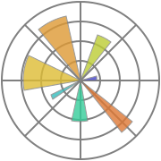

<h1 align="center">Hi 👋, I'm Cris Torres</h1>
<h3 align="center">A Data Scientist from Chile</h3>

- 🌱 I’m currently learning **Data Science, Machine Learning and Artificial Intelligence.**

- 📝 I regularly write articles on [Mathematics and Data Science.](https://crisleaf.medium.com/)

- 📫 How to reach me: **cristobal_javier@hotmail.com**

<h3 align="left">Connect with me:</h3>

<h3 align="left">Languages:</h3>

 

 

<h3 align="left">ML and AI Tools:</h3>

 

 
 

<h3 align="left">Data Tools:</h3>

<h3 align="left">Currently Learning:</h3>

 

